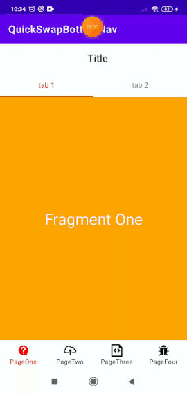

# Bug demo

### Demo

App consist of 4 main fragments accessable from bottom navigation, each fragment is a tablayout hosting 2 more child fragment, child fragment access its viewModel during `onCreateView()`



ViewModel is accessed in FragmentXContent [https://github.com/yatw/QuickSwapBottomNav/blob/master/app/src/main/java/com/example/quickswapbottomnav/Fragment1Content.kt](https://github.com/yatw/QuickSwapBottomNav/blob/master/app/src/main/java/com/example/quickswapbottomnav/Fragment1Content.kt)

#### Stacktrace
```
E/AndroidRuntime: FATAL EXCEPTION: main
Process: com.example.quickswapbottomnav, PID: 15640
java.lang.IllegalArgumentException: No destination with ID 2131230918 is on the NavController's back stack. The current destination is Destination(com.example.quickswapbottomnav:id/fragment1) label=Fragment1 class=com.example.quickswapbottomnav.Fragment1
at androidx.navigation.NavController.getBackStackEntry(NavController.java:1358)
at com.example.quickswapbottomnav.Fragment3Content$viewModel$2.invoke(Fragment3Content.kt:17)
at com.example.quickswapbottomnav.Fragment3Content$viewModel$2.invoke(Fragment3Content.kt:15)
at com.example.quickswapbottomnav.Fragment3Content$special$$inlined$navGraphViewModels$3.invoke(NavGraphViewModelLazy.kt:62)
at com.example.quickswapbottomnav.Fragment3Content$special$$inlined$navGraphViewModels$3.invoke(Unknown Source:0)
at androidx.lifecycle.ViewModelLazy.getValue(ViewModelProvider.kt:52)
at androidx.lifecycle.ViewModelLazy.getValue(ViewModelProvider.kt:41)
at com.example.quickswapbottomnav.Fragment3Content.getViewModel(Fragment3Content.kt:15)
at com.example.quickswapbottomnav.Fragment3Content.onViewCreated(Fragment3Content.kt:36)
at androidx.fragment.app.Fragment.performViewCreated(Fragment.java:2987)
at androidx.fragment.app.FragmentStateManager.createView(FragmentStateManager.java:546)
at androidx.fragment.app.FragmentStateManager.moveToExpectedState(FragmentStateManager.java:282)
at androidx.fragment.app.FragmentManager.executeOpsTogether(FragmentManager.java:2189)
at androidx.fragment.app.FragmentManager.removeRedundantOperationsAndExecute(FragmentManager.java:2100)
at androidx.fragment.app.FragmentManager.execSingleAction(FragmentManager.java:1971)
at androidx.fragment.app.BackStackRecord.commitNow(BackStackRecord.java:305)
at androidx.viewpager2.adapter.FragmentStateAdapter.placeFragmentInViewHolder(FragmentStateAdapter.java:341)
at androidx.viewpager2.adapter.FragmentStateAdapter.onViewAttachedToWindow(FragmentStateAdapter.java:276)
at androidx.viewpager2.adapter.FragmentStateAdapter.onViewAttachedToWindow(FragmentStateAdapter.java:67)
at androidx.recyclerview.widget.RecyclerView.dispatchChildAttached(RecyclerView.java:7556)
at androidx.recyclerview.widget.RecyclerView$5.addView(RecyclerView.java:860)
at androidx.recyclerview.widget.ChildHelper.addView(ChildHelper.java:107)
at androidx.recyclerview.widget.RecyclerView$LayoutManager.addViewInt(RecyclerView.java:8601)
at androidx.recyclerview.widget.RecyclerView$LayoutManager.addView(RecyclerView.java:8559)
at androidx.recyclerview.widget.RecyclerView$LayoutManager.addView(RecyclerView.java:8547)
at androidx.recyclerview.widget.LinearLayoutManager.layoutChunk(LinearLayoutManager.java:1641)
at androidx.recyclerview.widget.LinearLayoutManager.fill(LinearLayoutManager.java:1587)
at androidx.recyclerview.widget.LinearLayoutManager.onLayoutChildren(LinearLayoutManager.java:665)
at androidx.recyclerview.widget.RecyclerView.dispatchLayoutStep2(RecyclerView.java:4134)
at androidx.recyclerview.widget.RecyclerView.dispatchLayout(RecyclerView.java:3851)
at androidx.recyclerview.widget.RecyclerView.onLayout(RecyclerView.java:4404)
at android.view.View.layout(View.java:21964)
at android.view.ViewGroup.layout(ViewGroup.java:6317)
at androidx.viewpager2.widget.ViewPager2.onLayout(ViewPager2.java:527)
at android.view.View.layout(View.java:21964)
at android.view.ViewGroup.layout(ViewGroup.java:6317)
at androidx.constraintlayout.widget.ConstraintLayout.onLayout(ConstraintLayout.java:1873)
at android.view.View.layout(View.java:21964)
at android.view.ViewGroup.layout(ViewGroup.java:6317)
at android.widget.FrameLayout.layoutChildren(FrameLayout.java:332)
at android.widget.FrameLayout.onLayout(FrameLayout.java:270)
at android.view.View.layout(View.java:21964)
at android.view.ViewGroup.layout(ViewGroup.java:6317)
at android.widget.FrameLayout.layoutChildren(FrameLayout.java:332)
at android.widget.FrameLayout.onLayout(FrameLayout.java:270)
E/AndroidRuntime:     at android.view.View.layout(View.java:21964)
at android.view.ViewGroup.layout(ViewGroup.java:6317)
at androidx.constraintlayout.widget.ConstraintLayout.onLayout(ConstraintLayout.java:1873)
at android.view.View.layout(View.java:21964)
at android.view.ViewGroup.layout(ViewGroup.java:6317)
at android.widget.FrameLayout.layoutChildren(FrameLayout.java:332)
at android.widget.FrameLayout.onLayout(FrameLayout.java:270)
at android.view.View.layout(View.java:21964)
at android.view.ViewGroup.layout(ViewGroup.java:6317)
at androidx.appcompat.widget.ActionBarOverlayLayout.onLayout(ActionBarOverlayLayout.java:536)
at android.view.View.layout(View.java:21964)
at android.view.ViewGroup.layout(ViewGroup.java:6317)
at android.widget.FrameLayout.layoutChildren(FrameLayout.java:332)
at android.widget.FrameLayout.onLayout(FrameLayout.java:270)
at android.view.View.layout(View.java:21964)
at android.view.ViewGroup.layout(ViewGroup.java:6317)
at android.widget.LinearLayout.setChildFrame(LinearLayout.java:1829)
at android.widget.LinearLayout.layoutVertical(LinearLayout.java:1673)
at android.widget.LinearLayout.onLayout(LinearLayout.java:1582)
at android.view.View.layout(View.java:21964)
at android.view.ViewGroup.layout(ViewGroup.java:6317)
at android.widget.FrameLayout.layoutChildren(FrameLayout.java:332)
at android.widget.FrameLayout.onLayout(FrameLayout.java:270)
at com.android.internal.policy.DecorView.onLayout(DecorView.java:802)
at android.view.View.layout(View.java:21964)
at android.view.ViewGroup.layout(ViewGroup.java:6317)
at android.view.ViewRootImpl.performLayout(ViewRootImpl.java:3161)
at android.view.ViewRootImpl.performTraversals(ViewRootImpl.java:2671)
at android.view.ViewRootImpl.doTraversal(ViewRootImpl.java:1799)
at android.view.ViewRootImpl$TraversalRunnable.run(ViewRootImpl.java:7770)
at android.view.Choreographer$CallbackRecord.run(Choreographer.java:1031)
at android.view.Choreographer.doCallbacks(Choreographer.java:854)
at android.view.Choreographer.doFrame(Choreographer.java:789)
at android.view.Choreographer$FrameDisplayEventReceiver.run(Choreographer.java:1016)
at android.os.Handler.handleCallback(Handler.java:883)
at android.os.Handler.dispatchMessage(Handler.java:100)
at android.os.Looper.loop(Looper.java:221)
at android.app.ActivityThread.main(ActivityThread.java:7542)
at java.lang.reflect.Method.invoke(Native Method)
at com.android.internal.os.RuntimeInit$MethodAndArgsCaller.run(RuntimeInit.java:539)
at com.android.internal.os.ZygoteInit.main(ZygoteInit.java:950)
W/BpBinder: Slow Binder: BpBinder transact took 1664ms, interface=android.app.IActivityManager, code=6 oneway=false
I/Process: Sending signal. PID: 15640 SIG: 9

```